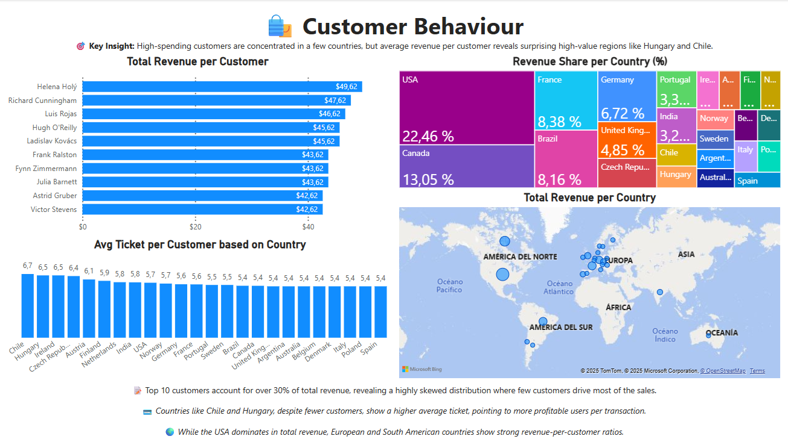
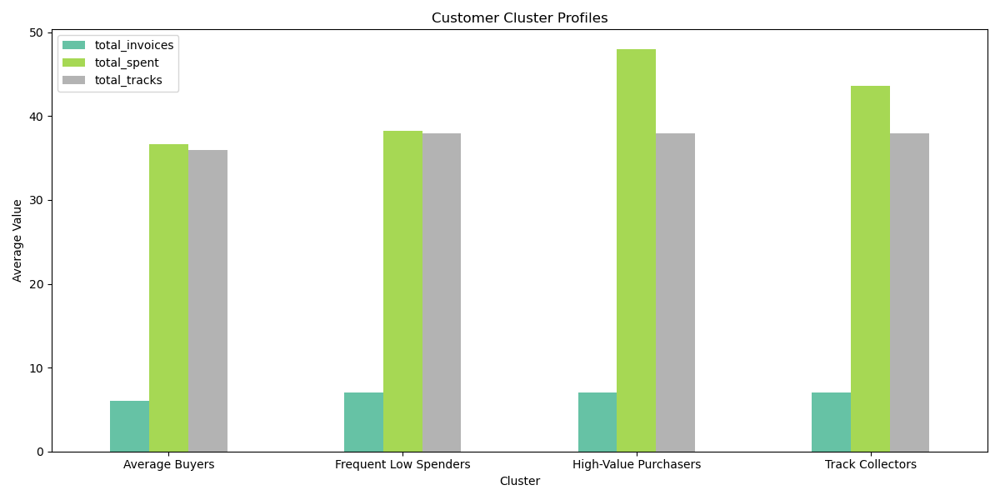

# 🎧 Music Business Insights – Exploratory Data Analysis with WSDA\_Music

Welcome to this data analysis project using the **WSDA\_Music** dataset – a rich SQL-based database simulating a music store's operations. This project showcases how to extract business insights using **SQL, Python (Pandas, Matplotlib)** and **Power BI**  for interactive visualization.

---

## 📚 Context

The music industry generates massive volumes of sales and listener data.  
This project simulates the analysis of a digital music store using a real-world relational database structure to extract actionable insights for sales strategy, marketing and catalog optimization.

It’s designed as a showcase of how data analysis can drive decisions in entertainment and retail.

---

## 🧠 Objective

To analyze music sales, customer behavior, and product performance to answer business questions and present clear, visual insights useful for both technical and non-technical audiences.

---

## 📂 Project Structure

```
WSDA_Music_Analysis/
│
├── data/
│   └── WSDA_Music.db                # SQLite database
│
├── notebooks/
│   ├── 01_exploration_sql.ipynb        # SQL queries and basic EDA
│   ├── 02_analysis_python.ipynb        # Data analysis & visualization
│   └── 03_clustering_customers.ipynb   # Customer segmentation (ML)
│
├── dashboard/
│   └── music_dashboard.pbix         # Power BI dashboard
│
├── images/
│   └── preview.png                  # Dashboard previews
│
├── README.md                        # Project overview
└── requirements.txt                 # Python dependencies
```

---

## 🔍 Key Business Questions

* Which genres and artists generate the most revenue?
* What are the sales trends across countries and time?
* Who are the top customers by spending?
* Are certain music categories more popular in specific regions?

---

## 🧰 Tech Stack

* **Languages**: SQL, Python (Pandas, Matplotlib)
* **Database**: SQLite
* **Visualization**: Power BI 
* **Notebook**: Jupyter

---

## 📊 Key Insights & Visuals

- 🎵 **Rock** genre had the highest average revenue per track, while **Opera** led in total track volume.
- 🌍 Most purchases came from **USA and Canada**, though **Brazil** had the highest revenue per customer.
- 🕒 Revenue peaked in the **second quarter** of the year, suggesting a seasonal pattern.

---

## 📸 Dashboard Preview



---

## 📦 Machine Learning Extension: Customer Segmentation

To enrich the business analysis with data science, we applied **KMeans clustering** to segment customers based on their behavior:

| Segment                | Description                                                                 |
|------------------------|------------------------------------------------------------------------------|
| 🤑 High-Value Purchasers | Few purchases, but high total spending – ideal for premium offerings          |
| 🔁 Frequent Low Spenders | Many purchases, low value – good for loyalty programs                         |
| 🎼 Track Collectors      | Purchase many individual tracks – possibly curators or collectors             |
| 🎯 Average Buyers        | Balanced across all features – general customer base                          |

### 📊 Visualizations:
- PCA scatterplot of clusters
- Bar chart comparing average behavior per segment
- Elbow method to validate optimal number of clusters



---

## 🚀 How to Use This Project

1. Clone this repository.
2. Open the Jupyter notebooks in the `notebooks/` folder.
3. Run `requirements.txt` to install Python packages.
4. Explore the optional Power BI dashboard in the `dashboard/` folder.

---

## 🧠 Personal Learnings

- Strengthened my SQL join and aggregation skills in a business context.
- Improved my use of Power BI for storytelling and dashboard interactivity.
- Learned to structure projects for reproducibility and clarity.

---

## ✍️ Author

**Néstor Piedra Q.** – Data Engineer & Aspiring Data Scientist
[LinkedIn](https://linkedin.com/in/nestor-piedra-319b48178) · [GitHub](https://github.com/SteamyCupGames)

---

## 📜 License

MIT License – Feel free to use and adapt this project for your own learning or portfolio.

---

## 💬 Feedback

Got ideas or feedback? Feel free to open an issue or connect with me on LinkedIn!
